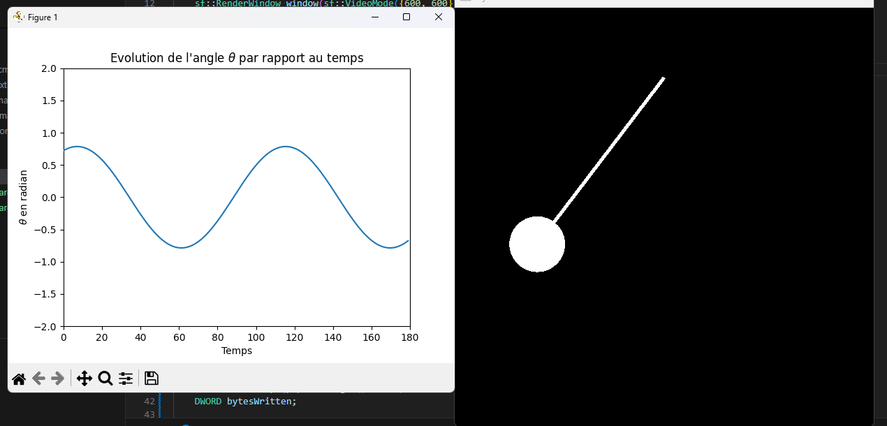

Simulation d'un pendule simple

1/ Compilation : cmake --build build
2/ Exécution du programme C++ : bin/main.exe
3/ Le programme C++ bloque car j'ai ajouté une interface de visualisation Python qu'il faut exécuter : visualisation.py

TODO : 
- ajouter frottement de l'air
- utiliser RK4
